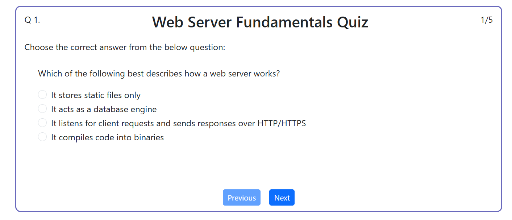

## Quiz App

A browser-based multiple-choice quiz application built with HTML, CSS, and JavaScript.

The application presents questions one at a time, allows users to navigate between questions while preserving their answers, calculates the final score, and provides an option to restart the quiz.

## Preview


## Features

- Displays **one question at a time** with four multiple-choice options  
- Tracks user-selected answers as they move between questions  
- Calculates and displays the **final score as a percentage**  
- Allows users to **navigate back** to previous questions  
- Includes a **Restart** feature to retake the quiz  
- All data (questions, options, and answers) are stored **in memory** no backend or database  


## Tech Stack
- **HTML5** – Structure of the quiz interface  
- **CSS3**, **boostrap** – Styling and layout  
- **JavaScript (ES6)** – Quiz logic and DOM manipulation 


## ⚙️ How It Works
1. The quiz data (questions, options, and answers) are stored in a JavaScript array.  
2. When the quiz starts, one question is displayed at a time.  
3. When the user selects an option and clicks **Next**, their answer is recorded in memory.  
4. After the final question and user clicks submit, the script calculates the total score and displays it.  
5. The user can restart the quiz to retake it without reloading the page.  


## 💡 Future Improvements
- Add a backend to store quiz questions and student scores  
- Include timer functionality for each question  
- Implement category-based quizzes 


## Run Locally
1. Clone this repository  
   ```bash
   git clone https://github.com/tolulope23-ops/Quiz-App.git


## Author

   Rachael Adeyemi
   Backend Developer focused on building reliable and maintainable software systems.

## License

   This project is available for educational and portfolio purposes.
